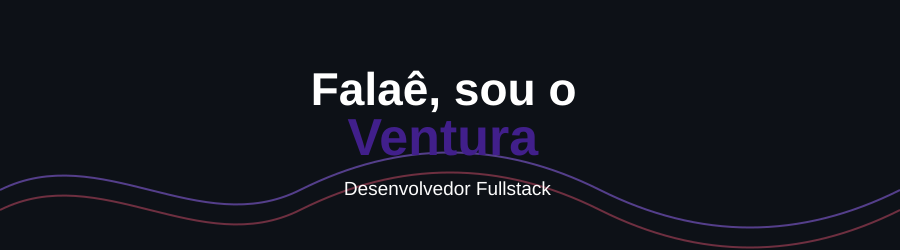

### Sobre Mim

Me chamo Otávio, mas sou conhecido como Ventura. Sou um aspirante a desenvolvedor e apaixonado por tecnologia em geral. Tenho grande interesse por hardware e automação de tarefas, o que me levou a escolher Python como minha principal linguagem de programação. No futuro, pretendo me aprofundar em outras linguagens e continuar ampliando meus conhecimentos na área de desenvolvimento.

Além da programação, tenho como hobby a criação de vídeos para o YouTube, onde compartilho conteúdos no meu canal [Ventura](https://www.youtube.com/@VenturaGameplays69). A criação de conteúdo é uma forma de explorar minha criatividade, aprender coisas novas e compartilhar meus interesses com outras pessoas.

    
    

---

### 

### Linguagens e Tecnologias

 
 

###  Estatísticas

  

